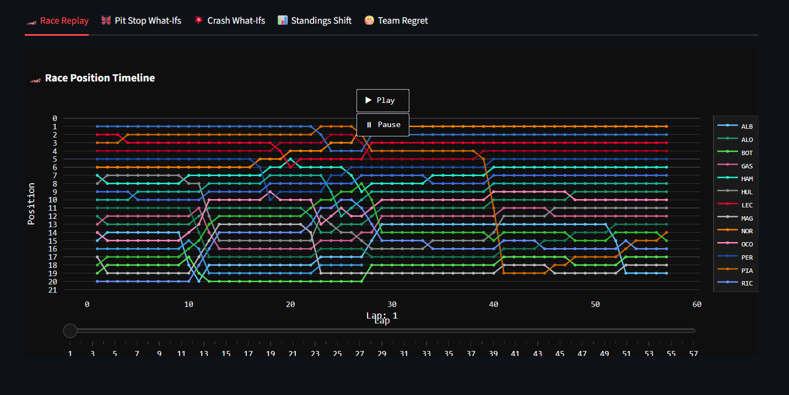
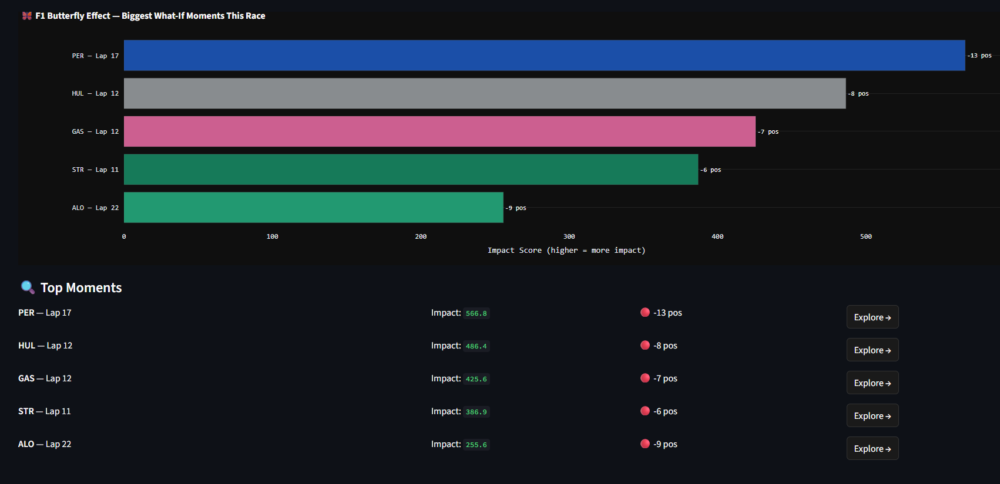
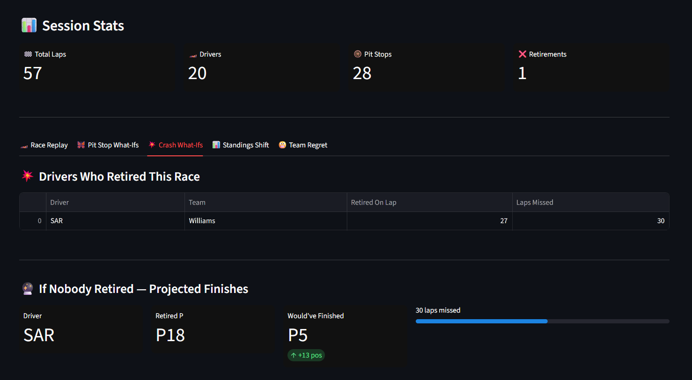

# 🦋 F1 Butterfly Effect Explorer

> *Rewrite any F1 race. See how one decision changed everything.*

Explore every pit stop, crash, and strategy call from any F1 race since 2018.
Toggle decisions on and off and watch the entire finishing order reshape itself
in real time — powered by real FastF1 telemetry data.

---

## Screenshots

### 🏎️ Race Replay


### 🦋 Butterfly Effect — What-If Moments


### 💥 Crash What-If


---

## Features
- 🏎️ Animated lap-by-lap race replay
- 🔀 Pit stop what-if engine — skip, early, or late
- 💥 Crash & retirement simulator — what if they finished?
- 📊 Standings shift visualizer
- 😬 Team regret scorer — who hurt themselves most

## Setup
```bash
git clone https://github.com/abrown33914/f1-butterfly-effect-explorer
cd f1-butterfly-effect-explorer
python -m venv venv
venv\Scripts\activate        # Windows
source venv/bin/activate     # Mac/Linux
pip install -r requirements.txt
streamlit run app.py
```

## Data
Powered by [FastF1](https://theoehrly.github.io/Fast-F1/) — real F1 telemetry and timing data going back to 2018.

## Stack
Python · FastF1 · Streamlit · Plotly · Pandas